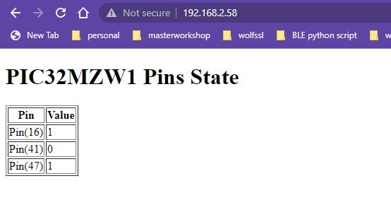

# Highlights
* This example show the device acting as TCP server, with a simple HTTP website to show some GPIO's value 
* Edit main.py, input variables *ssid* and *password* with the Target AP SSID and password
* Console log display the assigned IP address
* Connect your PC to the same network, browser the device webpge by typing http://<DEIVCE_IP_ADDR>, the webpage show the pin 16, 41, 47's value  

  

  

