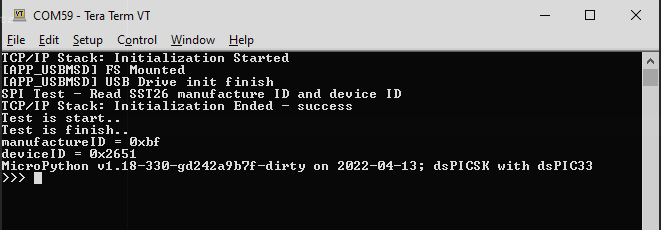

[](https://www.microchip.com)

# Peripherals Configuration
You can configure MCU peripherals like UART, I2C, GPIO etc. by using *umachine* moulde

## umachine module
You need to import the umachine module for peripherals configuration, there are different classes for differnet peripheral type.

## Class Pin
The *Pin* class is used to control the I/O pins. It has methods to set the mode of the pin (IN, OUT, etc) and methods to get and set the digital logic level.  
Available pins are: 9, 10, 12, 14, 15, 16, 17 ,18 25, 28, 34, 35, 41, 42, 44, 45, 46, 47, 48, 49.  
The details of the Pin functionality can be found in [Pin Functionality table](./readme.md#pin-functionality)  

This detail information of this class can be found at https://docs.micropython.org/en/latest/library/machine.Pin.html

Below is an example of setting the GPIO Pin
```
from umachine import Pin

p15 = Pin(15, Pin.OUT)    # create output pin on RPK12 (Red color LED on the WFI32-IoT Board)
p15.on()                 # set pin to "on" (high) level
p15.off()                # set pin to "off" (low) level
p15.value(1)             # set pin to on/high

p14 = Pin(14, Pin.IN)     # create input pin on RPC15 (Mikro bus CS pin on the WFI32-IoT Board)
print(p14.value())       # get value, 0 or 1

p16 = Pin(16, Pin.OUT, value=1) # set pin high on creation
```

Below is an example of setting the GPIO Pin to Interrupt Pin:
```
from umachine import Pin

def callback_test(p):
    print("IRQ event is triggered..")

p14 = Pin(14, mode=Pin.IN)
p14.irq(handler=callback_test, trigger=Pin.IRQ_RISING)

while True:
    pass

```

* Limition: Umachine module Pin class do not support PULL_UP and PULL_DOWN, OPEN_DRAIN, Pin.IRQ_LOW_LEVEL and Pin.IRQ_HIGH_LEVEL constants

## Class UART
The *UART* class is used to control the UART bus to send/ recveive data. It has methods to read/ write the data through UART bus.  
Only UART bus 2 is available for users to use while UART1 and UART3 is not avaialbe as UART1 and UART3 are used to print out the application and WLAN log of the device.  
The details of the Pin functionality can be found in [Pin Functionality table](./readme.md#pin-functionality)

This detail information of this class can be found at https://docs.micropython.org/en/latest/library/machine.UART.html

Below is an example of setting the UART bus 2, Pin 28 and Pin 48 are configured to be te TX and RX UART pin in below example, "timeout" specifies the time to wait for the first character in ms
You can connect a USB-UART convertor from the PC to these pin according to below table for the tests.

UART-USB Converter | WFI32 Mirko Bus Conector
--- | --- 
UART TX | RX 
UART RX | TX 
GND | GND 
--- | --- 

```
>>> from umachine import UART
>>> uart=UART(2, 230400, tx=28, rx=48, timeout=5000)
>>> uart.write('Testing')
>>> uart.read(10)

```

* Limition: Methods *sendbreak* and *irq * are not supported

## Class SPI
The *SPI* class is used to control the SPI bus to send/ recveive data. It has methods to read/ write the data through SPI bus.  
Only SPI bus 2 is available for users to use while SPI1 is not avaialbe as SPI1 is used to communicate with the on-board external SPI flash.  
The details of the Pin functionality can be found in [Pin Functionality table](./readme.md#pin-functionality)

This detail information of this class can be found at https://docs.micropython.org/en/latest/library/machine.SPI.html

Below is an example of using SPI 2 to communciate with the SST26 SPI Flash and read the manufacturer and product ID.
To perform the test, you can plug the [SQI SuperFlash Kit 1](https://www.microchip.com/en-us/development-tool/ac243009) (Part number: AC243009) to the mikroBUS connector on the WFI32-IoT board


```
from umachine import SPI
from umachine import Pin
import utime

print("SPI Test - Read SST26 manufacture ID and device ID")

spi=SPI(2)
rst_pin = Pin(12, mode=Pin.OUT)	# reset pin
cs_pin = Pin(14, mode=Pin.OUT)	# cs pin

rst_pin.on()
utime.sleep(1)
cs_pin.on()

utime.sleep(1)

print("Test is start..")
cs_pin.off()
spi.write(b'\x66')	# sst26 enable reset command
cs_pin.on()

cs_pin.off()
spi.write(b'\x99')	# sst26 memory reset command
cs_pin.on()


cs_pin.off()
spi.write(b'\x06')	# sst26 enable write command
cs_pin.on()

cs_pin.off()
spi.write(b'\x98')	# sst26 global block protection unlock command
cs_pin.on()

txdata = b"\x9f\xAA\xAA\xAA"	# sst26 jedec id read command
rxdata = bytearray(4)

cs_pin.off()
spi.write_readinto(txdata, rxdata)
cs_pin.on()
print("Test is finish..")

print("manufactureID = " + hex(rxdata[1]))
print("deviceID = " + hex(rxdata[2] <<8 | rxdata[3]))

```

Output of the example:

</p>
  <p align="center">
  </p>


## Class I2C
The *I2C* class is used to control the I2C bus to send/ recveive data. It has methods to read/ write the data through I2C bus.
Only I2C bus 1 is available for users to use while I2C2 is not routed out from the PIC32MZW1 modules.  
The details of the Pin functionality can be found in [Pin Functionality table](./readme.md#pin-functionality)

This detail information of this class can be found at https://docs.micropython.org/en/latest/library/machine.I2C.html

Below is an example of using I2C 2 to communciate with the Heart Rate Mikro Click Board
To perform the test, you can plug the [the Heart Rate Mikro Click Board](https://www.mikroe.com/heart-rate-click) to the mikroBUS connector on the WFI32-IoT board

```
from umachine import I2C
i2c=I2C(1)
i2c.writeto(0x57, b"12345678")  # write value to the I2C heart rate click board

i2c.readfrom_mem(0x57, 0xFF,1)  # read the click board part ID

```

## Class ADC
The *ADC* class provides an interface to analog-to-digital convertors, and represents a single endpoint that can sample a continuous voltage and convert it to a discretised value.
Available pins are: 35, 41, 42, 44, 45, 46, 47, 48, 49  
The details of the Pin functionality can be found in [Pin Functionality table](./readme.md#pin-functionality)

This detail information of this class can be found at https://docs.micropython.org/en/latest/library/machine.ADC.html

Below is an example to test the ADC pin (pin 42). To do the test, you can input singal to pin 42 (MikroBus (INT) pin on WFI32-IoT board or XPRO Header (Pin8) on Curiosity board):
```
from umachine import ADC
adc = ADC(42)    # create an ADC object acting on pin 42 (AN15)
adc.read_u16()    # read a raw analog value in the range 0-65535
```

## Class Timer
The *Timer* class provides an interface to utilize the hardware timer.
3 timers (0, 1, 2) are availabe to use.
This detail information of this class can be found at https://docs.micropython.org/en/latest/library/machine.Timer.html

Below is an example to test the timer:
```
from umachine import Timer

def timerCallback(t):
    print("timer is triggered..")
    pass

tim=Timer(0)
tim.init(period=2000, callback=timerCallback)

while 1:
    pass
```