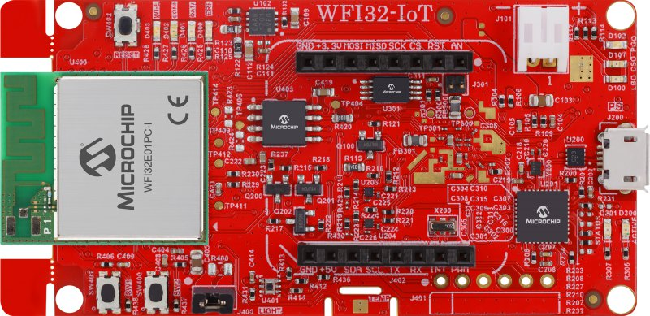
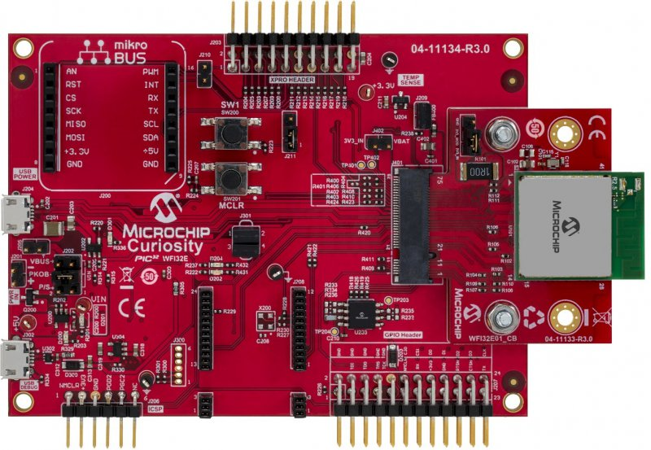
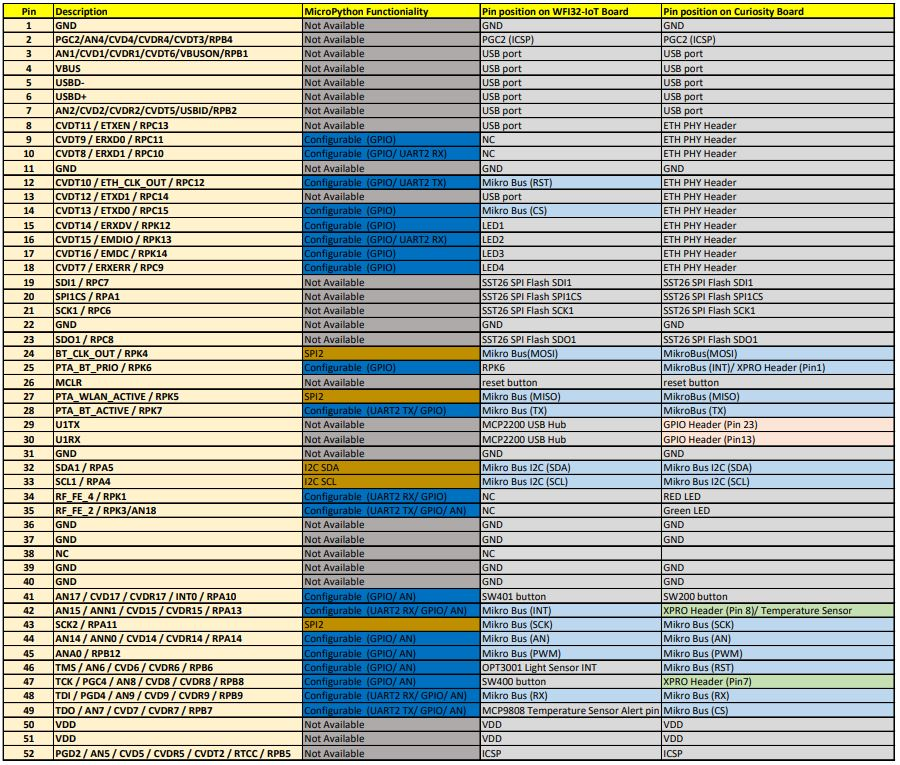
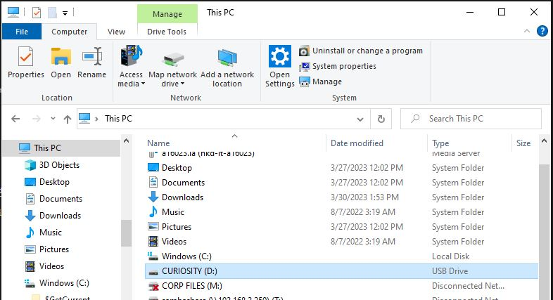
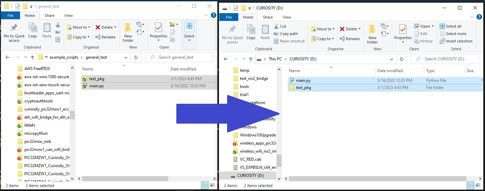
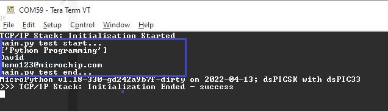
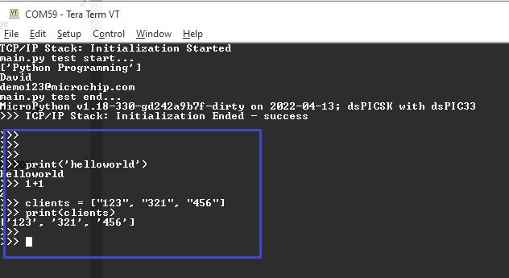
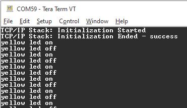
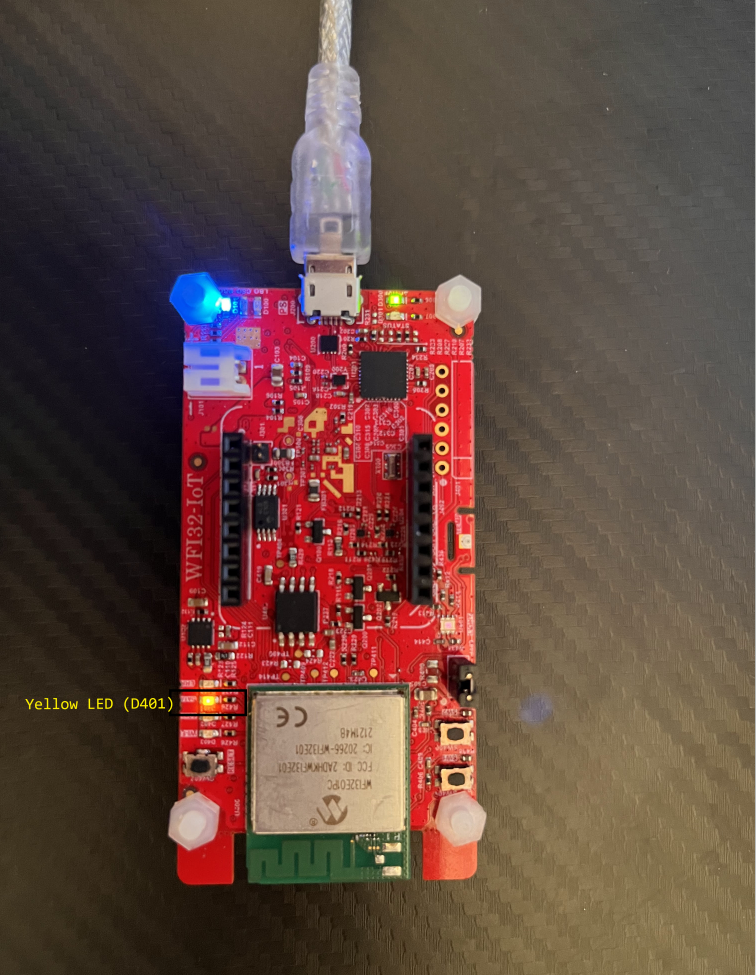

# MicroPython on PIC32MZW1
This project support the MicroPython on [WFI32E01PC (PIC32MZW1)](https://www.microchip.com/en-us/product/WFI32E01PC) Wi-Fi MCU module by running the MicroPthon library.  
MicroPython is a Python 3 implementation with small subset of Python standard library. It run on embedded MCU to compile and interpreter the Python scripts.  
With this feature, users can run python scripts on WFI32E01PC (PIC32MZW1) MCU to simplify the software development.  MicroPython highly abstract the software of Rio2. Users can develop the code more easy with the high-level language.   
This is good for rapid prototyping , quick evaluation and automated tests.

# Evaluation Board
The MicroPython project can run on two PIC32MZW1 Evluation boards. They are the WFI32-IoT Development Board and the WFI32E Curiosity Board

## 1. WFI32-IoT Development Board
Click [here](https://www.microchip.com/en-us/development-tool/EV36W50A) for the details of the board

  

  

## 2. PIC32 WFI32E Curiosity Board
Click [here](https://www.microchip.com/en-us/development-tool/EV12F11A) for the details of the board

  

  

# Software Requirements
- [MPLAB X IDE](https://www.microchip.com/en-us/development-tools-tools-and-software/mplab-x-ide) (v6.00 or later)
- [MPLAB XC32](https://www.microchip.com/en-us/development-tools-tools-and-software/mplab-xc-compilers) (v4.30 or later)
- [MPLAB Harmony 3](https://www.microchip.com/en-us/development-tools-tools-and-software/embedded-software-center/mplab-harmony-v3)

	- Note: The project was developed and tested using the MPLAB X v6.05 and MPLAB XC32 v4.30

# Pin Functionality
Below table show the pin functionality on PIC32MZW1 module when it work with MicroPython. Some pins are configurable while some pins are fixed usage. Some pins are not availalbe as they are connected to some components on the board.  
The right two columns show the posiion of the pin on the WFI32-IoT Development Board and the WFI32E Curiosity Board.  
You can check this table to detemine the connection of your application.

  

  

# MicroPython modules
Below are the MicroPython modules which supported in this project.
## Python standard libraries and micro-libraries
* [gc](https://docs.micropython.org/en/latest/library/gc.html) - control the garbage collector
* [uselect](https://docs.micropython.org/en/latest/library/select.html) - wait for events on a set of streams
* [socket](network_socket.md) - socket module
* [utime](https://docs.micropython.org/en/latest/library/time.html) - time related functions
* [array](https://docs.micropython.org/en/latest/library/array.html) – arrays of numeric data
* [ucollections](https://docs.micropython.org/en/latest/library/collections.html) – collection and container types
* [ustruct](https://docs.micropython.org/en/latest/library/struct.html) – pack and unpack primitive data types

## MicroPython-specific libraries
* [umachine](machine.md) - functions related to the hardware
* [network](wlan.md) - network configuration

# Setup and Tests
1. Build and program the project *firmware/pic32mz_w1_curiosity_freertos.X*  into the hardware using MPLABX IDE
2. Connect the board to the PC using the micro-USB cable
3. If you are using WFI32-IoT board, the computer detect there are two virtual COM ports. One print the appliaction log when the other print Wi-Fi FW log.  
   Use a UART terminal (e.g. Teraterm) to open the COM port (baudrate: 115200 8N1) to read the application log.  
   If you are using Curiosity board, you can connect a USB-UART converter to the UART1 pins in the GPIO header(J207) of the Curiosity Board and open a UART terminal in the PC with settings 115200 8N1  
   > UART Tx and Rx pins are marked in the GPIO Header (J207) silkscreen
4. When the board is power on, it emulated as a USB MSD. You can browser the USB drive (the name is "CURIOSITY") on the PC using the file browser.

  

  

5. Copy the example scripts in the *example_scripts/general_test/* directory from your PC to the board.

  

  

6. Reboot the board, the python scripts will be executed. The results are printed on the console log like below:

  

  

7. You can also type the MicroPython command for tests:

  

  

8. If you are using the WFI32-IoT board, You can also test by copying the *example_scripts/gpio_on_off_led/main.py* to the board
9. Reboot the board, the python scripts will be executed. Yello LED on the WFI32-IoT board blink every 2 seconds, hardware timer is used to trigger the on/off of the LED.

  

  

# Demo Scripts
Directory *example_scripts/* contains different python scripts to demonstrate some basic use of the MicroPython  
Below list introduce the use of each demo scrtips.

Directory | Usage | Modules
--- | --- | ---
general_test | demonstrate the use of python packages, extract the email and author name | -
gpio_on_off_led | turn on/ off Yellow LED on WFI32-IoT board with timer interrupt | umachine
gpio_interrupt | demonostrate the use of gpio interrupt | umachine, utime
tcp_client | act as TCP client, create socket to conect to the TCP server and exchange data | network, socket
tcp_server_with_multiple_socket | create TCP server to handle multiple client socket simultaneously | network, socket, utime, gc, uselect
http_get | TCP client send HTTP Get command to get the webpage contents of a website | network, socket
http_server | set as softAP mode and run like a HTTP server. Remote device can connect to the softAP and browser the HTTP website | umachine, network, socket
spi_read_sst26_flash | read SST26 SPI flash's manufacturer id and device id by using SPI bus | umachine, utime

# Limitation
1. umachine module support Class Pin, ADC, UART, SPI, I2C and Timer, and do not support class PWM, I2S, RTC, WDT, SD, SDCard and Signal
2. Do not support the control of CAN bus, Ethernet and USB interface.
3. Do not support Virtual File System (VFS) feature
3. Do not support TLS secure connection
